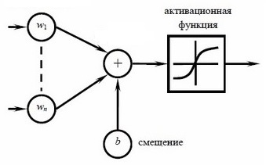

# Ann adventure

**Ann adventure** - интерактивное наглядное пособие о работе *искуственных нейронных сетей* (далее *ИНС*),
созданное в рамках научно-исследовательской работы для универа.

Является логическим продолжением моих ленных копаний в этой теме и 
результатом нежелания делать какие-то сомнительные проекты с непонятными условиями. ъуъ

Вдохновлено моими ранними работами над
[📁&nbsp;искуственным интеллектом в&nbsp;играх](https://github.com/DevMule/tick-tack-toe-ai) 
и
[📁&nbsp;библиотечкой с&nbsp;*ИНС*](https://github.com/DevMule/perceptron.py) 
на питоне. Можешь покопаться в них, там весело :)

## Зачем эта штука?
Эта штука может дать повеселиться.

А может и не дать.

А вообще, если ты не знаком с нейросетями, то у тебя есть возможность познакомиться с одной такой красавицей 
и даже посмотреть её код, если захочешь.

## Что это за штука?
Эта штука - реализация персептрона Розенблатта - простенькой нейросети.
А в месте с этим ещё и интерфейс для создания обучающей выборки, настройки сети и обучения.

#### Сложно? Сейчас объясню.  
Любая ИНС состоит из нейронов и соединений между ними. Эти соединения называются *синапсы*.

Вот так может выглядеть ИНС:  
  
Вот видны круги - нейроны, они соединены между собой линиями - синапсами.

Нейроны в ИНС, как и в мозге, взаимодействуют друг с другом через синапсы.

#### Как происходит взаимодействие?  
Нейрон может "активироваться", если некоторые соединённые с ним нейроны активированы.
В живом мозге "активированный" нейрон подаёт электрический сигнал соседям через синапсы. 
Активируется нейрон или нет - зависит от качества сигнала и количества других активных соседей.  
В ИНС Это сделано с использованием математики. Да, без неё в нашем мире туго, а вот надо было учиться в школе!  
Работают нейроны в ИНС следующим образом:

- Нейрон имеет числовое значение 0⩽Х⩽1.  
где 0 - совсем не активен, 1 - полностью активирован, 0.5 - активирован наполовину и т.п.

- Синапсы тоже имеют числовые значения -∞<W<+∞. зачем? сейчас узнаем)

Гуманитарии, АХТУНГ! Сейчас будет больно!  
- Значение нейрона находится так:  
    Сначала находятся произведения значений соседних нейронов с соответствующими им синапсами.  
    Затем эти произведения складываются и полученная сумма пропускается через *функцию активации*.  
    )  
    где *Y* - значение нейрона, *f* - функция активации нейрона, 
     - значение синапса i,  
     - значение нейрона i, *θ* - величина смещения.
    
Для чего нужна эта функция активации? Ну, сумма произведений может давать абсолютно любое вещественное значение,
а необходимое нам значение нейрона должно быть 0⩽Х⩽1.  

Такой функцией может быть сигмоида:  
  
Суёшь в неё *x*∈(-∞; +∞), а высовываешь из неё *y*∈[0; 1]. Круто :)  
Чуть позже я расскажу почему нужна именно такая функция.

#### Так, погодите! а для чего нужна эта "θ"? Мы о ней не говорили раньше!
Эта штука называется "***нейроном смещения***". Это тот же нейрон, соединённый только с одним нашим нейроном.    
  

**Зачем он нужен?**  
Регулирование значения нейрона смещения дает возможность сдвинуть функцию активации по оси X и достичь ранее 
недоступные участки. Сравни два рисунка ниже!  
     
Где-то вычитал что введение величины смещения способствуют уменьшению количества необходимых для работы нейронов. 
Тестировал и субъективно подтвердил эту теорию в
[📁&nbsp;тут](https://github.com/DevMule/perceptron.py).  
А ещё, по моему опыту, ИНС с внедрёнными нейронами смещения быстрее обучаются! Говорю же полезная штука!

#### Так, раз уж мы заговорили о работе ИНС, как она работает то?
Мы рассматриваем ИНС с прямой связью. Т.е. передачи сигнала в ней не образуют циклы.
Такая ИНС обычно состоит из ***слоёв***.   
На уже знакомом нам рисунке изображена нейросеть с тремя слоями (ещё бы).
При том, каждый нейрон одного слоя соединён с каждым нейроном другого слоя! Сложно то как!  
  
Давай разберёмся что это за слои!  
- Первый слой в ИНС занимают ***входные*** нейроны. 
    Значения этих нейронов задаются вручную пользователем или какой-нибудь внешней программой. 
    Сама нейросеть никак не меняет их значения.
- Последний слой состоит из ***выходных*** нейронов. Их значения это результат работы нейросети.
- Средний слой состоит из ***скрытых*** нейронов. Они называются так потому что пользователь не знает что в них происходит. 
    Он знает что на входе и знает что на выходе. Всё что посередине - непонятная магическая абстракция.
    Скрытых слоёв в ИНС прямого распространения может быть много, а может не быть совсем.

Итак, пользователь вводит что-то во входные нейроны и получает что-то в выходных нейронах!
Между вводом значений и получения ответа происходят расчёты которые называются "***feedforward***", что по-русски ""
примерно "вперёд кормить", а если точнее - "прямая связь". Я буду называть это *feedforward*.

#### → feedforward 
// todo

#### ← обратное распространение ошибки 
// todo
